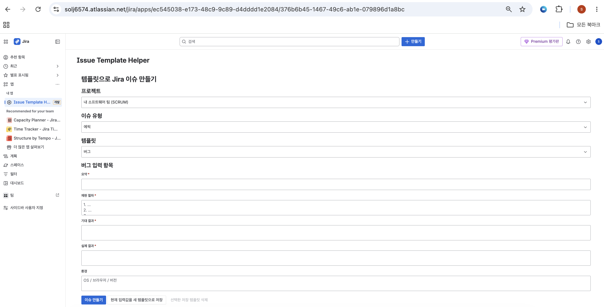
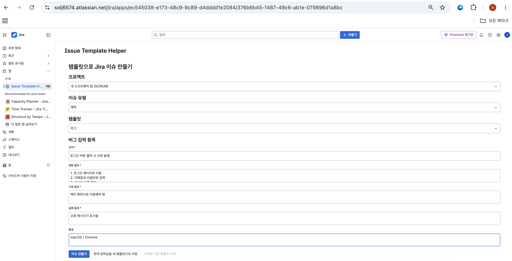
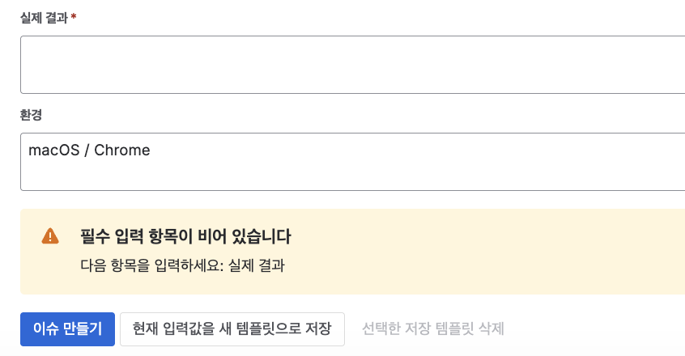
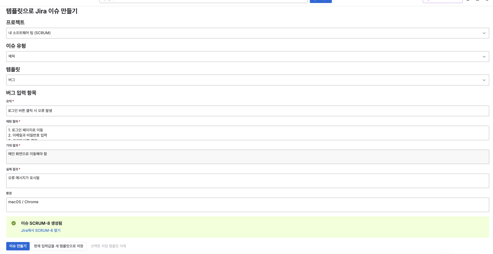
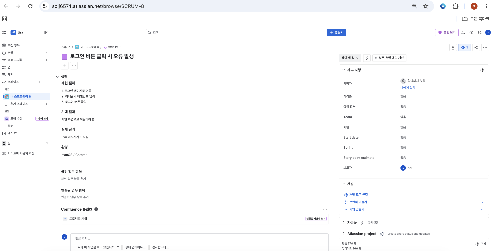

# Jira Issue Template Helper (Forge App)

Atlassian Forge UI Kit 2 기반의 Jira 앱입니다. 기획, QA, QC 담당자가 Jira 이슈를 만들 때 필요한 정보를 빠뜨리지 않도록 이슈 유형별 템플릿을 제공하고, 입력값을 Jira 이슈 본문으로 정리해 생성합니다.

## 데모 화면

### 템플릿 선택 및 이슈 입력



### Bug 템플릿 입력 예시



### 필수 입력값 검증



### 이슈 생성 완료



### 생성된 Jira 이슈



---

## 1. 주제 및 선정 이유

- **주제**: Jira 이슈 템플릿 생성 및 이슈 작성 표준화 Forge 앱
- **선정 이유**:
  - 기획, QA, QC 담당자마다 이슈 작성 형식이 달라지면 개발자는 재현 절차, 기대 결과, 실제 결과, 환경 정보를 다시 확인해야 합니다.
  - 이슈 생성 단계에서 필요한 항목을 템플릿으로 안내하면 커뮤니케이션 비용을 줄이고 개발 착수까지의 시간을 줄일 수 있습니다.
  - Jira 이슈 생성 흐름 안에서 바로 동작해야 하므로 Jira Cloud와 Forge UI Kit이 적합합니다.

## 2. 해결하려는 문제

| 문제 | 본 앱이 제공하는 해결책 |
| --- | --- |
| 이슈 작성자가 양식을 매번 새로 채운다 | Jira globalPage에 Bug / Feature Request / QA Defect 템플릿을 제공한다. |
| 필수 정보가 누락된 채 이슈가 등록된다 | 템플릿의 `required` 필드를 검사해 누락 시 생성 전에 안내한다. |
| 이슈 본문 포맷이 사용자마다 다르다 | 입력값을 ADF(Atlassian Document Format) 문서로 변환해 동일한 형식의 description으로 생성한다. |
| Jira 사이트마다 이슈 유형 이름이 다를 수 있다 | 프로젝트별 실제 이슈 유형 목록을 REST API로 조회해 선택하게 한다. |
| 자주 쓰는 입력 양식을 재사용하기 어렵다 | 현재 입력값을 기본값으로 가진 사용자 템플릿을 Forge KVS에 저장하고 다시 불러온다. |

## 3. 주요 기능

1. **프로젝트 선택** — `/rest/api/3/project/search`로 현재 사용자가 접근 가능한 프로젝트를 조회합니다.
2. **이슈 유형 선택** — `/rest/api/3/project/{key}`로 선택한 프로젝트의 이슈 유형을 불러오고, 실제 Jira issue type id로 이슈를 생성합니다.
3. **템플릿 선택** — Bug / Feature Request / QA Defect 기본 템플릿과 사용자 저장 템플릿을 선택할 수 있습니다.
4. **템플릿 기반 입력 폼** — 템플릿 정의의 `fields[]`에 따라 Textfield / TextArea / Select를 동적으로 렌더링합니다.
5. **필수값 검증** — 프론트엔드와 resolver 양쪽에서 필수 항목 누락을 확인합니다.
6. **Jira 이슈 생성** — Jira REST API `POST /rest/api/3/issue`를 `api.asUser().requestJira()`로 호출합니다.
7. **템플릿 저장, 수정 및 삭제** — 기본 템플릿에서 저장하면 새 사용자 템플릿을 만들고, 저장 템플릿에서 저장하면 해당 템플릿을 수정합니다. 선택한 저장 템플릿만 삭제할 수도 있습니다.
8. **이슈 링크 제공** — 생성 성공 시 Jira browse 링크를 표시합니다.

## 4. 기술 스택 및 구조

### 4.1 기술 스택

- **Atlassian Forge**
- **Jira Cloud**
- **Forge UI Kit 2** (`@forge/react`)
- **Forge Bridge** (`@forge/bridge`)
- **Forge Resolver** (`@forge/resolver`)
- **Forge KVS** (`@forge/kvs`)
- **Jira REST API** (`@forge/api`)
- **Node.js 내장 test runner** (`node:test`)

### 4.2 디렉터리 구조

```text
jira-issue-template-helper/
  manifest.yml                  # Forge 모듈/리소스/권한 선언
  package.json
  README.md
  docs/screenshots/             # 데모 스크린샷
  src/
    index.js                    # Resolver 진입점
    resolvers/
      templates.js              # templates.getAll | save | delete
      issues.js                 # issues.create | issues.getSummary
      projects.js               # projects.list | projects.listIssueTypes
    lib/
      defaultTemplates.js       # 기본 템플릿 3종
      validation.js             # 필수값 검증
      adf.js                    # 폼값 -> Jira ADF 변환
      __tests__/                # 단위 테스트
    frontend/
      global-page/index.jsx     # jira:globalPage UI
      components/
        TemplateSelector.jsx
        IssueForm.jsx
        ValidationBanner.jsx
      lib/                      # src/lib 재내보내기
```

### 4.3 Forge 모듈

| 모듈 | 역할 |
| --- | --- |
| `jira:globalPage` | 사용자가 프로젝트, 이슈 유형, 템플릿을 선택하고 Jira 이슈를 생성하는 메인 화면 |
| `function` | 템플릿 저장/조회, 프로젝트 조회, Jira 이슈 생성 resolver |

### 4.4 데이터 흐름

```text
[UI Kit globalPage]
   │ invoke('issues.create', payload)
   ▼
[Forge Resolver: src/index.js]
   │ registerTemplates / registerIssues / registerProjects
   ▼
[Resolver handlers]
   │ ├─ Forge KVS: 사용자 템플릿 저장/조회
   │ ├─ Jira REST: 프로젝트/이슈 유형 조회 및 이슈 생성
   │ └─ src/lib: 검증 및 ADF 변환
   ▼
[생성된 이슈 키와 링크 반환]
```

## 5. 실행 방법

### 5.1 사전 준비

- Forge CLI 설치: `npm i -g @forge/cli`
- Forge CLI 로그인: `forge login`

### 5.2 설치 및 배포

```bash
# 1. 의존성 설치
npm install

# 2. 매니페스트/코드 검증
forge lint

# 3. development 환경에 배포
forge deploy --non-interactive --environment development

# 4. Jira 사이트에 설치
forge install --non-interactive --site <your-site>.atlassian.net --product jira --environment development

# scopes 또는 모듈 변경 후 이미 설치된 앱을 갱신할 때
forge install --non-interactive --upgrade --site <your-site>.atlassian.net --product jira --environment development
```

### 5.3 테스트 실행

```bash
npm test
```

`src/lib/__tests__/` 아래 helper 함수(validation / adf / defaultTemplates)에 대한 단위 테스트가 실행됩니다.

### 5.4 사용

Jira 좌측 사이드바 또는 앱 메뉴에서 **Issue Template Helper** 글로벌 페이지를 열고 다음 순서로 사용합니다.

1. 프로젝트 선택
2. Jira 이슈 유형 선택
3. Bug / Feature Request / QA Defect 템플릿 선택
4. 필수 항목 입력
5. 이슈 생성
6. 생성된 Jira 이슈 링크 확인

## 6. 구현 범위

- [x] Forge UI Kit 2 기반 `jira:globalPage`
- [x] 프로젝트 목록 조회
- [x] 프로젝트별 이슈 유형 조회
- [x] Bug / Feature Request / QA Defect 기본 템플릿
- [x] 템플릿 기반 동적 입력 폼
- [x] 한글 IME 입력이 깨지지 않는 입력 처리
- [x] 프론트엔드 필수값 검증
- [x] resolver 측 필수값 재검증
- [x] Jira ADF description 생성
- [x] Jira REST API 기반 이슈 생성
- [x] Forge KVS 기반 사용자 템플릿 저장/수정/불러오기
- [x] 선택한 사용자 저장 템플릿 삭제
- [x] 생성된 이슈 링크 표시
- [x] Node.js 단위 테스트

## 7. 미구현 범위

- GitHub / GitLab / Bitbucket API를 통한 실제 브랜치 자동 생성
- Jira workflow 상태 자동 변경
- Confluence 페이지 기반 이슈 초안 생성
- AI 기반 이슈 내용 자동 요약 및 보정
- 프로젝트별 상세 권한 관리
- 이슈 본문 ADF 미리보기
- 사용자 입력값 자동 임시 저장

브랜치 자동 생성은 보안 토큰 관리, 저장소 선택, 권한 검증, 중복 브랜치 처리 등 고려해야 할 요소가 많아 MVP 범위에서는 제외했습니다. 이번 구현은 Jira 이슈 작성 품질 표준화와 이슈 생성 흐름 완성도에 집중합니다.

## 8. 개선 방향

- 프로젝트별 템플릿 관리 기능
- 사용자 역할에 따른 템플릿 접근 제어
- 이슈 생성 후 담당자, 라벨, 우선순위 자동 설정
- ADF Renderer를 활용한 제출 전 이슈 본문 미리보기
- Confluence 요구사항 페이지에서 Jira 이슈 초안 생성
- AI를 활용한 summary / description / acceptance criteria 초안 생성
- Git 서비스 연동을 통한 브랜치 자동 생성 기능

## 9. AI 활용

본 프로젝트에서는 아이디어 구체화, 기능 범위 조정, Forge 앱 구조 설계, 코드 검토 및 제출 문서 정리 과정에서 AI를 활용했습니다.

초기 아이디어에는 Jira 상태 변경 시 Git feature branch를 자동 생성하는 기능도 포함되어 있었지만, MVP 범위와 보안/권한 복잡도를 고려해 최종 구현에서는 제외했습니다. 대신 Jira 이슈 생성 단계의 템플릿 제공, 필수값 검증, Jira REST API를 통한 이슈 생성, Forge KVS 기반 템플릿 저장 기능에 집중했습니다.

AI가 제안한 코드와 API 사용 방식은 최종적으로 사람이 검토했고, Forge UI Kit에서 지원되는 컴포넌트만 사용하는지, `@forge/ui`를 사용하지 않는지, Jira REST API 호출에 필요한 scope가 과도하지 않은지 확인했습니다.

---

## 부록 A. Forge 앱 ID

`manifest.yml`의 `app.id`는 기존 등록값(`ari:cloud:ecosystem::app/ec545038-…-d4dddd1e2084`)을 유지합니다. 따라서 신규 `forge register` 없이 동일 등록 앱으로 계속 배포할 수 있습니다.

## 부록 B. 주요 트러블슈팅 메모

- 한국어 Jira에서 이슈 유형 이름이 달라지는 문제 → 하드코딩된 "Bug"/"Task" 대신 프로젝트별 이슈 유형 id를 조회해 사용
- 한글 입력이 `ㅌㅔㅅㅡㅌㅡ`처럼 분리되는 문제 → Textfield/TextArea를 `defaultValue` 기반으로 변경해 IME 조합 중 리렌더 간섭 제거
- 저장된 과거 템플릿이 기본 템플릿 라벨을 영어로 덮어쓰는 문제 → 기본 템플릿의 한국어 라벨/필드 정의는 보존하고 저장된 기본값만 병합
- Custom UI와 UI Kit 2의 manifest 차이 → `render: native` 명시
- `@forge/api`의 deprecated storage 대신 `@forge/kvs` 사용
